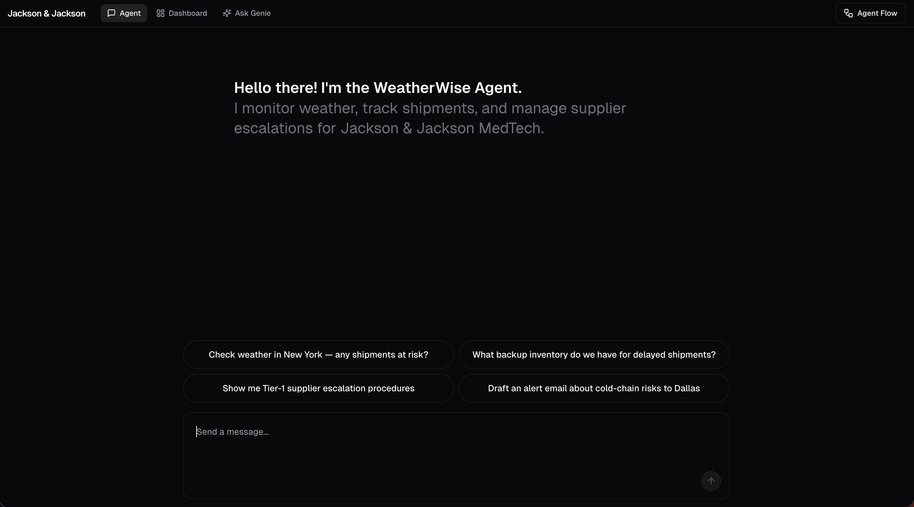
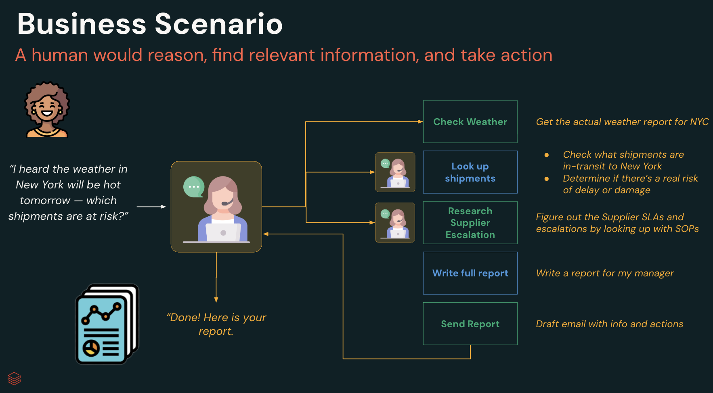
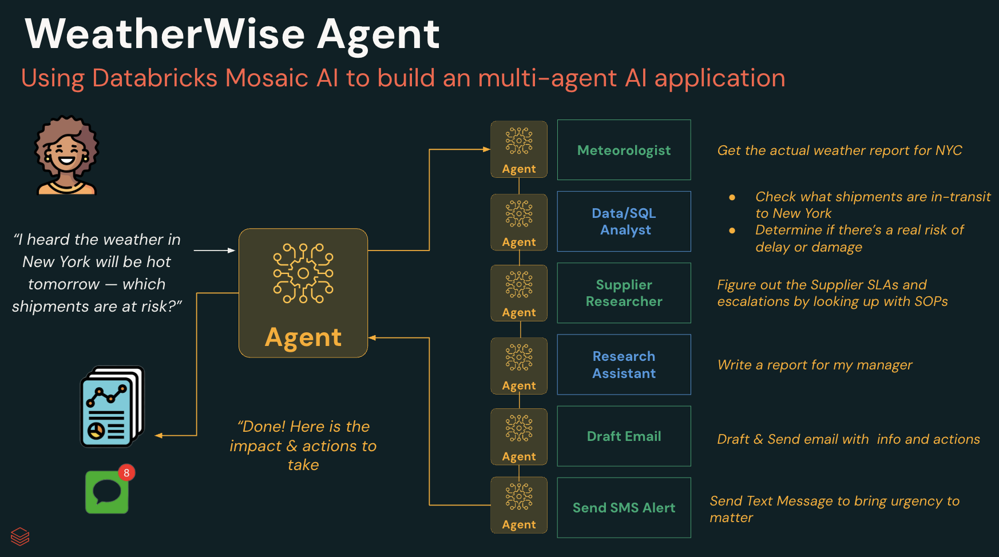

## MedTech - WeatherWise Supply Chain Escalation Agent

The **WeatherWise Supply Chain Escalation Agent** helps MedTech operations teams **anticipate and mitigate weather-related shipment risks** using live data, predictive reasoning, and automated escalation workflows.



---

### Mission
Detect and resolve **shipment disruptions** before they impact **patients, compliance, or cost**.

---

### Scenario

Business Process


Agent Flow


---

### Architecture


---

### Example Queries

| Category | Example |
|-----------|----------|
| **Full Automation** | "The weather in New York will be hot tomorrow. Which in-transit shipments are at risk, what escalation steps should I take, and is there a backup supplier nearby? Email me a report and send an SMS summary." |
| **Weather Risks** | "Which shipments are at risk due to high temperatures in NYC?" |
| **Delivery Status** | "Show in-transit implant shipments for this week." |
| **Supplier SOPs** | "What's Zimmer's escalation process for temperature exceptions?" |

---

### Business Value

#### Speed
- **Hours to seconds** for risk detection
- Automated **weather + shipment correlation**
- One-click **escalation and notification**

#### Savings
- Avoids **spoilage, delays, and SLA fines**
- Reduces **manual triage workload**
- Maximizes **on-time, in-spec delivery**

#### Compliance
- Follows **supplier SOPs automatically**
- Provides **audit-ready traceability**
- Strengthens **patient safety assurance**

---

### Escalation Crew — Agents and Tools

#### METEOROLOGIST
**Role:** Weather and risk analyst
**Goal:** Analyze forecast data and compute temperature gaps between ambient and shipment thresholds
**Tools:** `check_weather`, `temp_gap`

---

#### SQL ANALYST
**Role:** Data analyst focused on MedTech shipment logistics
**Goal:** Retrieve shipments (optionally filtered by destination and/or status) and expose the maximum allowable temperatures needed for risk evaluation
**Tools:** `get_shipments`, `get_backup_inventory`

---

#### SUPPLIER RESEARCHER
**Role:** Knowledge analyst specializing in supplier compliance and escalation workflows
**Goal:** Identify supplier-specific SOPs, escalation contacts, and nearby backup inventory
**Tools:** `get_supplier_details`, `search_supplier_sops`

---

#### EMAIL COPYWRITER
**Role:** Communications agent for detailed escalation summaries
**Goal:** Compose and send email reports summarizing affected shipments and next steps
**Tools:** `send_email` (via any email service API)

---

#### TEXTER
**Role:** Rapid notifier for short alerts
**Goal:** Send SMS notifications to field or operations teams for immediate awareness
**Tools:** `send_sms` (via any SMS service)

---

### Tools Overview

#### Unity Catalog Tools
| Tool | Description |
|------|--------------|
| `get_shipments` | Retrieve shipment, carrier, and temperature data |
| `get_backup_inventory` | Identify alternate or nearby stock locations |
| `get_supplier_details` | Retrieve supplier info and escalation contacts |
| `temp_gap` | Calculate ambient vs. threshold temperature differences |
| `search_supplier_sops` | Retrieve escalation SOPs from the vector search index |

#### Custom Tools
| Tool | Description |
|------|--------------|
| `check_weather` | Get live or forecasted weather for destination routes |
| `send_email` | Send escalation summaries via **Mailgun** (or any email service API) |
| `send_sms` | Send short alerts via **Twilio SMS** |

---

### Demo Data Sources

| File | Description |
|------|--------------|
| `shipments.csv` | Shipment details, ETA, carrier, and temperature logs |
| `suppliers.csv` | Supplier contacts and escalation references |
| `inventory.csv` | Warehouse and backup inventory data |
| `supplier_sops.csv` | Supplier SOPs and escalation documents (for RAG) |

---

## Installation & Setup

### Prerequisites

* **Databricks workspace** with **Unity Catalog** enabled
* **MLflow 3.0+** with **Model Serving**

#### Optional Custom Tools

* **Mailgun** — for email alerts. Obtain API credentials from your Mailgun account.
* **Twilio** — for SMS alerts. Obtain API credentials from your Twilio account.

> **Note:**
> If you don't plan to use Email or SMS, remove those tools from `weatherwise_agent.py` and update the system prompt accordingly.
> If you do plan to use them, configure the services first, then use `tests/manually_test_tools.ipynb` to verify the integrations before running the agent.

---

### Repository Structure
```
/agent_src
├── weatherwise_agent.py          # Core LangGraph agent
├── agent_eval_notebook.ipynb     # Testing, evaluation, registration, and deployment
├── tools/
│   ├── uc_tools/                 # UC SQL functions & vector index creation
│   ├── custom_tools/             # Weather, Email, SMS tools
/chatapp                          # Databricks App (Node.js/React)
/data
├── setup_data.ipynb              # Data & Unity Catalog setup
├── *.csv                         # Demo data files
/tests
├── manually_test_tools.ipynb     # Manual tool testing
.env                              # Environment variables
```

---

### 1. Configure Environment

Update your **`.env`** file with all required credentials and environment variables.

---

### 2. Load Data & Initialize Assets

Run **`data/setup_data.ipynb`** to:
* Load CSV files into **Delta tables**
* Create **Unity Catalog functions**
* Build the **Vector Search index**
* Apply required access grants

---

### 3. Create Tools

> **Tip:** Before creating tools, inspect the system prompt in `agent_src/weatherwise_agent.py` to understand the agent's persona, tools, and workflow.

* Run **`agent_src/tools/uc_tools/tool_uc_functions.ipynb`** to create Unity Catalog tools
* Run **`agent_src/tools/uc_tools/tool_uc_vector_index.ipynb`** to create the Vector Search index

---

### 4. Build, Test, and Deploy the Agent

> **Tip:** First, review the system prompt in `agent_src/weatherwise_agent.py` and modify as needed.

Run **`agent_src/agent_eval_notebook.ipynb`** — all cells sequentially:

| Step | Description |
|------|--------------|
| **a. Setup MLflow** | Initialize experiment tracking |
| **b. Import Agent** | Load logic from `weatherwise_agent.py` |
| **c. Unit Tests** | Validate tools, data pipelines, and logic |
| **d. Run Evals** | Use `mlflow.genai` with LLM judges (Correctness, Safety, Relevance, Guidelines) |
| **e. Register Model** | Register the agent to Unity Catalog |
| **f. Deploy** | Launch the agent via Databricks **Model Serving** |

---

© 2025 — *Authored by Bobby Leach*
