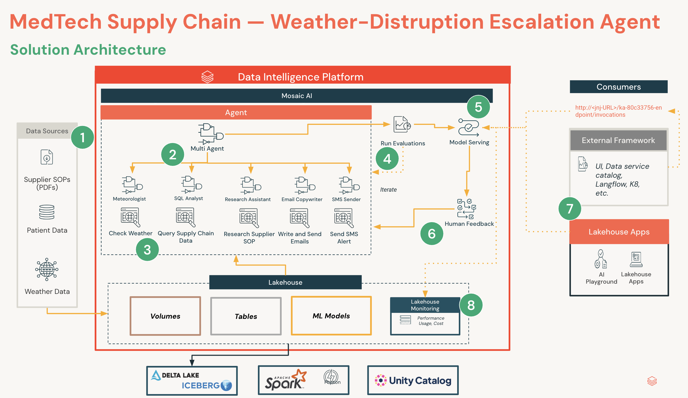

## 🌦 MedTech - WeatherWise Supply Chain Escalation Agent

The **WeatherWise Supply Chain Escalation Agent** helps MedTech operations teams **anticipate and mitigate weather-related shipment risks** using live data, predictive reasoning, and automated escalation workflows.

---

### 🎯 Mission
Detect and resolve **shipment disruptions** before they impact **patients, compliance, or cost**.

---

### 💬 Example Queries

| Category | Example |
|-----------|----------|
| **Full Automation** | “The weather in New York will be hot tomorrow. Which in-transit shipments are at risk, what escalation steps should I take, and is there a backup supplier nearby? Email me a report and send an SMS summary.” |
| **Weather Risks** | “Which shipments are at risk due to high temperatures in NYC?” |
| **Delivery Status** | “Show in-transit implant shipments for this week.” |
| **Supplier SOPs** | “What’s Zimmer’s escalation process for temperature exceptions?” |

---

### 💡 Business Value

#### 🌍 Operational Impact
- Cuts response time from **hours → seconds**  
- Unifies **shipments, weather, and supplier data**  
- Automates **escalations and compliance actions**

#### 💰 Efficiency
- Prevents **spoilage and stockouts**  
- Avoids **SLA penalties** via early alerts  
- Improves **team efficiency** with AI-assisted workflows  

#### 🛡️ Risk & Compliance
- Enforces **SOP-aligned escalation steps**  
- Ensures **audit-ready traceability**  
- Protects **patient safety** with proactive interventions  

---

### 🧱 Solution Architecture Snapshot

---

### 🧠 How It Works — The Escalation Crew

A coordinated **Crew of Specialized Agents** collaborates to assess risk and trigger the right actions:

- **Meteorologist** — Analyzes forecasts and computes temperature gaps.  
- **SQL Analyst** — Retrieves shipment and temperature data from Unity Catalog.  
- **Supplier Researcher** — Finds backup inventory, contacts, and SOPs.  
- **Email Copywriter** — Sends detailed escalation reports via email.  
- **Texter** — Sends concise SMS summaries for rapid awareness.  

Each agent contributes insights, ensuring every escalation is **data-driven, SOP-aligned, and actionable**.

---

### ⚙️ Tools Overview

#### 🔹 Unity Catalog Tools
| Tool | Description |
|------|--------------|
| `get_shipments` | Retrieve shipment, carrier, and temperature data |
| `get_backup_inventory` | Identify alternate or nearby stock locations |
| `get_supplier_details` | Retrieve supplier info and escalation contacts |
| `temp_gap` | Calculate ambient vs. threshold temperature differences |
| `search_supplier_sops` | Retrieve escalation SOPs from the **`supplier_sops_vs_index`** vector search index |

#### 🔹 Custom Tools
| Tool | Description |
|------|--------------|
| `check_weather` | Get live or forecasted weather for destination routes |
| `send_email` | Send escalation summaries via AWS SES |
| `send_sms` | Send short alerts via Twilio SMS |

---

### 🧩 Demo Data Sources

| File | Description |
|------|--------------|
| `demo_shipments.csv` | Shipment details, ETA, carrier, and temperature logs |
| `demo_suppliers.csv` | Supplier contacts and escalation references |
| `demo_inventory.csv` | Warehouse and backup inventory data |
| `demo_supplier_sops.csv` | Supplier SOPs and escalation documents (for RAG) |

---

© 2025 — *Authored by Bobby Leach*